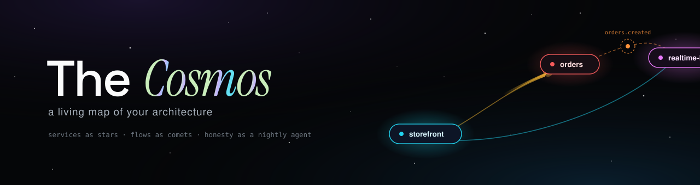
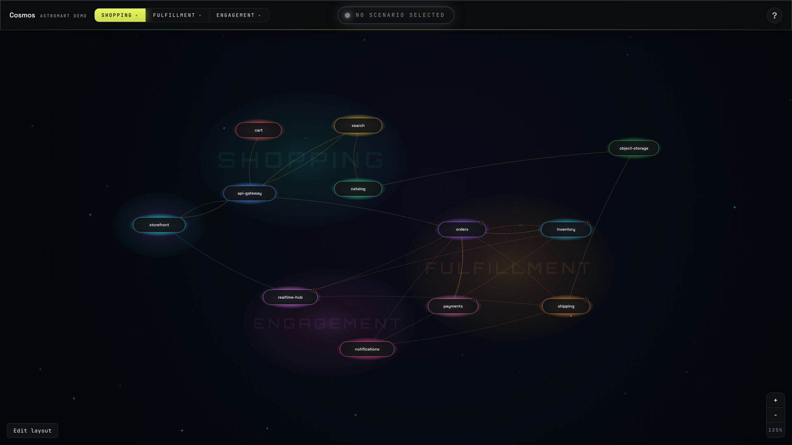
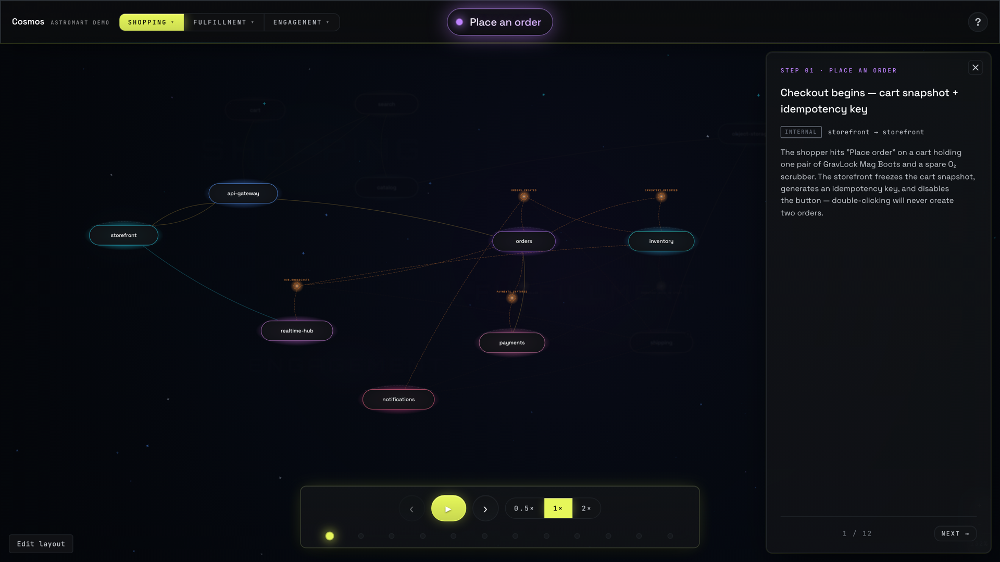

<p align="center">
  
</p>

# The Cosmos

[](https://github.com/ludeo-labs/cosmos-os/actions/workflows/validate-on-pr.yml)
[](https://ludeo-labs.github.io/cosmos-os/)
[](https://github.com/ludeo-labs/cosmos-os/releases)
[](LICENSE)

**A living map of your architecture.** Every service is a star. Kafka topics orbit between them. Real flows play as comets you can watch, pause, and inspect — payloads included. And a nightly AI agent keeps the whole map honest against your actual code.

<p align="center">
  <a href="https://ludeo-labs.github.io/cosmos-os/"><b>▶ Live demo</b></a> ·
  <a href="#quickstart">Quickstart</a> ·
  <a href="#make-it-your-cosmos">Make it yours</a> ·
  <a href="#drift-sync">Drift Sync</a>
</p>

<p align="center">
  
</p>

## Why

Every architecture diagram starts dying the moment it's born. The wiki page is from two reorgs ago, the Lucidchart link is stale, and the only reliable documentation is a senior engineer with a whiteboard. Cosmos takes a different bet:

1. **The map is the source, not a mirror.** Everything you see — services, topics, flows — is one set of plain TypeScript files. No backend, no database, no sync job to a diagramming SaaS.
2. **Flows are playable, not drawn.** A scenario is a real request traced hop-by-hop: URL, headers, payload, what got produced to which topic, what got written to which database. Press play and watch it fly.
3. **Honesty is automated.** A nightly agent diffs your repos against the map and opens one PR per team when reality moved. Forgetting to update the docs stops being an option.

## What's in the box

- 🗺️ **The map** — an animated SVG cosmos of your services (capsules), Kafka topics (orbitals), and protocol-colored connections (HTTP amber, WebSocket cyan, Kafka orange).
- 🎬 **Scenario player** — named end-to-end flows play as comets along real curved paths, with a step panel showing the actual request/response payloads at every hop. Deep-linkable (`?domain=…&scenario=…&step=…`).
- 🔍 **Service passports** — click any star: owner team, repo link, stack, databases, and why it exists.
- 🪐 **Service ecosystems** — umbrella services expand into a mini solar system of sub-services; packets re-route through the internals during playback.
- ✏️ **Layout edit mode** — hit `Edit layout` (or press `L`), drag stars and topics where you want them, then `Copy coords` and paste the values into the data files. Try it in the live demo — your rearrangement stays in your browser only.
- 🤖 **Two Claude skills** — `/add-service` and `/add-scenario` teach [Claude Code](https://claude.com/claude-code) to interrogate your repos and grow the map for you: who do you call, what do you produce, to which topic, what database are you hiding.
- 🌙 **Drift Sync** — the nightly honesty robot. Diffs every tracked repo against a baseline SHA, filters noise with cheap regexes, asks an AI agent "does the map still tell the truth?", and opens one tidy PR per team with file:line evidence.

## Quickstart

Requires Node ≥ 20.

```bash
git clone https://github.com/ludeo-labs/cosmos-os.git
cd cosmos-os
npm install
npm run dev
```

Open http://localhost:5173 — you're looking at **AstroMart**, a fictional space-gear e-commerce platform that ships with the repo as demo data. Pick a domain, choose a scenario (start with *Place an order*), press play.

<p align="center">
  
</p>

## Make it your cosmos

The entire universe lives in `src/scenarios/` — plain, typed TypeScript:

| Concept | What it is | Where |
|---|---|---|
| **Service** | A deployed process → a capsule on the map | `services.ts` |
| **Topic** | A Kafka topic used as an edge → an orbital node | `topics.ts` |
| **Domain** | A group of related scenarios | `scenarios.ts` |
| **Scenario** | A named, playable end-to-end flow | `scenarios.ts` |
| **Step** | One hop: from → to, protocol, payload | `steps/*.ts` |

**Start from the template:** click **Use this template** on GitHub (or clone), then:

```bash
npm install
npm run fresh   # replaces AstroMart with a minimal 2-star starter cosmos
npm run dev     # your galaxy, ready to grow
```

Two ways to populate it:

**With Claude Code (recommended)** — the repo ships with two skills. Open the repo (plus your service repos) in a Claude Code workspace and say:

```
/add-service payments
/add-scenario show me what happens when a customer checks out
```

You can also install the skills into any environment as a plugin, no clone needed:

```
/plugin marketplace add ludeo-labs/cosmos-os
/plugin install cosmos@cosmos-os
```

…then use `/cosmos:add-service` and `/cosmos:add-scenario` anywhere.

The skills make Claude read your actual source — call sites, producers, consumers, schemas — and write verified entries. No guessing allowed; the skill files are the guardrails.

**By hand** — copy any AstroMart entry, follow the shapes in `types.ts`, and keep three invariants: unique ids, `hex` matches the color token, and `phaseId`s are global and never reused. `npm run build` type-checks everything.

Placing nodes is easiest visually: enter **Edit layout** mode, drag things into place, `Copy coords`, and paste the numbers back into `services.ts` / `topics.ts`. Topics normally auto-arrange in a ring around their owning service — if a ring slot collides with a neighbor, set `pinned: true` on the topic and it fans out to your hand-placed coordinates instead.

To start clean, empty the arrays in `services.ts`, `topics.ts`, `scenarios.ts`, and `steps/`, then grow your own sky.

## Drift Sync

The map you can't trust is worthless — so Cosmos ships with its own lie detector. Every night:

```
clone tracked repos → diff vs baseline SHA → regex prefilter (~95% exit free)
   → AI agent reads the survivors → drift verdict with file:line evidence
   → applier edits the map, validates in-loop → one draft PR per team → Slack ping
```

Merging the PR bumps the baseline inside the same PR — merge means caught-up, no state cron needed. Full setup (GitHub PAT, Anthropic API key, optional Slack) in [`drift-sync/README.md`](drift-sync/README.md). It's off by default on forks; enable it when you're ready.

## Tech notes

- Vite + React 18 + TypeScript (strict). One build, no server, ~13 KB gzipped of data.
- Comets glide on the **real rendered SVG paths** (GSAP MotionPath + `getPointAtLength()`), not approximations.
- The hyperspace intro is a plain `<canvas>` and one perspective formula — no 3D library.
- OKLCH color tokens, themeable (`cosmos`, `light`, `minimal`, `dark`).

## Origin

Cosmos began as an internal tool at [Ludeo](https://ludeo.com), built to answer "wait, what happens after the client sends this?" without archaeology. The open-source version is the same map with a fictional universe on it.

## Contributing

PRs welcome — [CONTRIBUTING.md](CONTRIBUTING.md) has the dev setup and the three invariants that bite. Security reports: see [SECURITY.md](SECURITY.md).

## License

[MIT](LICENSE) © Omer Sher
